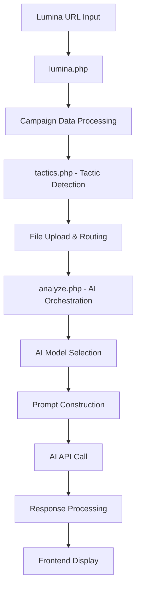

# Report.AI - AI Integration Architecture Plan

## Executive Summary

This document provides a comprehensive architectural plan for integrating the Report.AI backend components with AI API systems. Based on thorough analysis of the existing codebase, this plan outlines a production-ready architecture that can handle complex campaign data parsing, schema context filtering, and comprehensive AI-powered analysis generation.

## Current Architecture Analysis

### 1. Backend Component Overview

The Report.AI backend consists of several interconnected components:

#### Core API Endpoints
- **`/api/lumina.php`** - Fetches campaign data from Lumina API
- **`/api/tactics.php`** - Detects tactics from campaign lineItems
- **`/api/analyze.php`** - Primary AI analysis orchestrator
- **`/api/sections.php`** - Manages report sections and templates
- **`/api/ai-test.php`** - AI model testing interface

#### Schema Management System
- **`SchemaManager.php`** - Hierarchical product/subproduct/tactic management
- **`Database.php`** - MySQL connectivity with transaction support
- **`ai-models-config.php`** - Multi-provider AI model configuration

#### Data Flow Architecture


### 2. Current AI Integration Components

#### AI Models Configuration (`ai-models-config.php`)
- **Anthropic Claude**: Sonnet 4, Opus 4.1, Sonnet 3.7
- **Google Gemini**: 2.5 Pro, 2.5 Flash Lite
- **OpenAI GPT**: GPT-5 (placeholder for GPT-4 Turbo)
- **Multi-provider fallback system**
- **Environment-based API key management**

#### Prompt Construction System (`analyze.php`)
- **Tactic-separated analysis** - Each tactic analyzed independently
- **Context inheritance** - Campaign, company, and objective framing
- **Tone configuration** - 6 preset tones (professional, concise, etc.)
- **Custom instructions support**
- **Structured output format** with consistent sections

### 3. Schema Context Management

#### Hierarchical Schema Structure
```
Products (Platform Level)
├── Meta (Facebook/Instagram)
├── Google (YouTube, Google Ads)
├── Blended Tactics (Xandr, Trade Desk)
└── Subproducts (Campaign Types)
    └── Tactic Types (Specific Implementations)
        ├── Expected Filenames
        ├── Header Mappings
        └── Performance Tables
```

#### Current Schema Files
- **`enhanced_tactic_categories.json`** - Legacy tactic definitions
- **Database-driven schema** - Products, subproducts, tactic_types tables
- **Lumina extractors** - API response mapping configuration
- **Benchmarks system** - Performance thresholds and goals

## Architectural Improvements Plan

### 1. Enhanced AI Integration Architecture

#### A. Context-Aware AI Pipeline

**Current Challenge**: AI prompts don't leverage the rich schema context available in the database.

**Solution**: Implement a context filtering and enrichment system:

```php
class AIContextManager {
    private $schemaManager;
    private $contextFilters;
    
    public function buildEnrichedContext($campaignData, $detectedTactics, $companyInfo) {
        $enrichedContext = [];
        
        foreach ($detectedTactics as $tactic) {
            // Get schema context for this specific tactic
            $tacticSchema = $this->schemaManager->getTacticSchema($tactic['platform'], $tactic['subProduct']);
            
            // Apply context filters
            $relevantContext = $this->filterContextByTactic($tacticSchema, $tactic);
            
            // Add benchmarks and KPIs
            $benchmarks = $this->schemaManager->getBenchmarksByTactic($tactic);
            
            $enrichedContext[$tactic['name']] = [
                'schema' => $relevantContext,
                'benchmarks' => $benchmarks,
                'lumina_extractors' => $this->getLuminaExtractorsForTactic($tactic),
                'performance_guidelines' => $this->getPerformanceGuidelines($tactic)
            ];
        }
        
        return $enrichedContext;
    }
}
```

#### B. Advanced Prompt Construction System

**Enhanced Base Prompt Template**:

```php
class AdvancedPromptBuilder {
    private $contextManager;
    private $templateEngine;
    
    public function buildAnalysisPrompt($campaignData, $enrichedContext, $aiConfig) {
        $basePrompt = $this->getBaseRoleDefinition($aiConfig['tone']);
        
        // Add schema-aware context
        $schemaContext = $this->buildSchemaContext($enrichedContext);
        
        // Add dynamic benchmarking
        $benchmarkContext = $this->buildBenchmarkContext($enrichedContext);
        
        // Add tactic-specific instructions
        $tacticInstructions = $this->buildTacticInstructions($enrichedContext);
        
        return $this->templateEngine->render('analysis_prompt.tpl', [
            'base_role' => $basePrompt,
            'schema_context' => $schemaContext,
            'benchmark_context' => $benchmarkContext,
            'tactic_instructions' => $tacticInstructions,
            'campaign_data' => $campaignData,
            'custom_instructions' => $aiConfig['customInstructions'] ?? ''
        ]);
    }
}
```

### 2. Database Schema Enhancement

#### Enhanced Database Structure

```sql
-- Enhanced tactic context table
CREATE TABLE tactic_ai_context (
    id INT PRIMARY KEY AUTO_INCREMENT,
    tactic_type_id INT,
    ai_role_definition TEXT,
    analysis_guidelines TEXT,
    benchmark_interpretation TEXT,
    performance_kpis JSON,
    common_issues JSON,
    optimization_strategies JSON,
    created_at TIMESTAMP DEFAULT CURRENT_TIMESTAMP,
    FOREIGN KEY (tactic_type_id) REFERENCES tactic_types(id)
);

-- AI prompt templates
CREATE TABLE ai_prompt_templates (
    id INT PRIMARY KEY AUTO_INCREMENT,
    template_name VARCHAR(100),
    template_type ENUM('base_role', 'tactic_specific', 'section_specific'),
    content TEXT,
    variables JSON,
    is_active BOOLEAN DEFAULT TRUE,
    created_at TIMESTAMP DEFAULT CURRENT_TIMESTAMP
);

-- Analysis history and performance tracking
CREATE TABLE analysis_performance (
    id INT PRIMARY KEY AUTO_INCREMENT,
    campaign_id VARCHAR(50),
    model_used VARCHAR(50),
    temperature FLOAT,
    prompt_tokens INT,
    completion_tokens INT,
    analysis_quality_score FLOAT,
    user_feedback JSON,
    processing_time_seconds FLOAT,
    created_at TIMESTAMP DEFAULT CURRENT_TIMESTAMP
);
```

### 3. Enhanced API Endpoint Design

#### A. Restructured Analysis Pipeline

**New endpoint**: `/api/v2/analyze-campaign.php`

```php
<?php
/**
 * Enhanced Campaign Analysis API v2
 * Features context-aware AI integration with schema intelligence
 */

require_once '../core/AdvancedAnalysisOrchestrator.php';

class CampaignAnalysisV2 {
    private $orchestrator;
    
    public function __construct() {
        $this->orchestrator = new AdvancedAnalysisOrchestrator();
    }
    
    public function analyze($request) {
        // 1. Enhanced campaign data processing
        $processedCampaign = $this->orchestrator->processCampaignData($request['campaignData']);
        
        // 2. Schema-aware tactic detection
        $enrichedTactics = $this->orchestrator->detectAndEnrichTactics($processedCampaign);
        
        // 3. Context filtering and preparation
        $aiContext = $this->orchestrator->buildAIContext($enrichedTactics, $request['companyInfo']);
        
        // 4. Intelligent model selection
        $selectedModel = $this->orchestrator->selectOptimalModel($aiContext, $request['requirements']);
        
        // 5. Advanced prompt construction
        $optimizedPrompt = $this->orchestrator->buildOptimizedPrompt($aiContext, $request['aiConfig']);
        
        // 6. AI analysis with streaming support
        $analysisResult = $this->orchestrator->executeAnalysis($selectedModel, $optimizedPrompt, $request['streamingEnabled'] ?? false);
        
        // 7. Post-processing and validation
        $validatedResult = $this->orchestrator->validateAndEnrichResult($analysisResult, $aiContext);
        
        return $validatedResult;
    }
}
```

#### B. Real-time Analysis Status API

**New endpoint**: `/api/v2/analysis-status.php`

```php
class AnalysisStatusManager {
    public function getStatus($analysisId) {
        return [
            'status' => 'processing', // queued, processing, completed, failed
            'progress' => 0.65,
            'currentStage' => 'ai_analysis',
            'stages' => [
                'data_processing' => ['status' => 'completed', 'duration' => 1.2],
                'tactic_detection' => ['status' => 'completed', 'duration' => 0.8],
                'context_building' => ['status' => 'completed', 'duration' => 0.5],
                'ai_analysis' => ['status' => 'processing', 'progress' => 0.65],
                'post_processing' => ['status' => 'pending']
            ],
            'estimatedCompletion' => '2024-03-15T10:45:00Z'
        ];
    }
}
```

### 4. Advanced Schema Context System

#### A. Dynamic Schema Loading

```php
class DynamicSchemaLoader {
    private $cacheManager;
    private $schemaVersioning;
    
    public function getSchemaForTactic($tacticIdentifier) {
        // Check cache first
        $cacheKey = "schema_context_{$tacticIdentifier}";
        $cached = $this->cacheManager->get($cacheKey);
        
        if ($cached && !$this->schemaVersioning->hasChanged($tacticIdentifier)) {
            return $cached;
        }
        
        // Load from database with joins
        $schema = $this->loadFullSchemaContext($tacticIdentifier);
        
        // Cache for performance
        $this->cacheManager->set($cacheKey, $schema, 3600); // 1 hour
        
        return $schema;
    }
    
    private function loadFullSchemaContext($tacticIdentifier) {
        $sql = "
            SELECT 
                p.name as product_name,
                p.ai_guidelines,
                p.ai_prompt,
                sp.name as subproduct_name,
                tt.name as tactic_name,
                tt.headers,
                tt.expected_filenames,
                b.metric_name,
                b.goal_value,
                b.warning_threshold,
                tac.analysis_guidelines,
                tac.performance_kpis
            FROM products p
            JOIN subproducts sp ON p.id = sp.product_id
            JOIN tactic_types tt ON sp.id = tt.subproduct_id
            LEFT JOIN benchmarks b ON p.id = b.product_id
            LEFT JOIN tactic_ai_context tac ON tt.id = tac.tactic_type_id
            WHERE tt.slug = ? OR tt.data_value = ?
        ";
        
        return $this->database->fetchAll($sql, [$tacticIdentifier, $tacticIdentifier]);
    }
}
```

#### B. Context Inheritance System

```php
class ContextInheritanceManager {
    public function buildInheritedContext($tacticSchema) {
        $inheritedContext = [
            // Product-level context (highest priority)
            'product_guidelines' => $tacticSchema['ai_guidelines'] ?? '',
            'product_prompt' => $tacticSchema['ai_prompt'] ?? '',
            
            // Subproduct-level context
            'subproduct_specifics' => $this->getSubproductContext($tacticSchema),
            
            // Tactic-level context (most specific)
            'tactic_guidelines' => $tacticSchema['analysis_guidelines'] ?? '',
            'performance_kpis' => json_decode($tacticSchema['performance_kpis'] ?? '[]', true),
            
            // Merged benchmarks
            'benchmarks' => $this->buildBenchmarkContext($tacticSchema),
            
            // File processing context
            'expected_data_structure' => [
                'headers' => json_decode($tacticSchema['headers'] ?? '[]', true),
                'expected_files' => json_decode($tacticSchema['expected_filenames'] ?? '[]', true)
            ]
        ];
        
        return $inheritedContext;
    }
}
```

### 5. Performance Optimization & Caching

#### A. Multi-Layer Caching Strategy

```php
class PerformanceCacheManager {
    private $redisClient;
    private $fileCache;
    private $memoryCache;
    
    public function getCachedAnalysis($cacheKey) {
        // L1: Memory cache (fastest)
        if ($result = $this->memoryCache->get($cacheKey)) {
            return $result;
        }
        
        // L2: Redis cache (fast)
        if ($this->redisClient && ($result = $this->redisClient->get($cacheKey))) {
            $this->memoryCache->set($cacheKey, $result, 300); // 5 minutes
            return json_decode($result, true);
        }
        
        // L3: File cache (fallback)
        if ($result = $this->fileCache->get($cacheKey)) {
            if ($this->redisClient) {
                $this->redisClient->setex($cacheKey, 1800, json_encode($result)); // 30 minutes
            }
            return $result;
        }
        
        return null;
    }
}
```

#### B. Async Processing Queue

```php
class AnalysisQueueManager {
    private $queueAdapter;
    
    public function queueAnalysis($analysisRequest) {
        $jobId = $this->generateJobId();
        
        $job = [
            'id' => $jobId,
            'type' => 'campaign_analysis',
            'data' => $analysisRequest,
            'priority' => $this->calculatePriority($analysisRequest),
            'created_at' => time(),
            'attempts' => 0
        ];
        
        $this->queueAdapter->push('analysis_queue', $job);
        
        return $jobId;
    }
    
    private function calculatePriority($request) {
        // Higher priority for:
        // - Smaller datasets
        // - Premium users
        // - Real-time requests
        $priority = 50; // Base priority
        
        if ($request['realtime'] ?? false) $priority += 30;
        if (($request['fileCount'] ?? 0) < 5) $priority += 10;
        if ($request['userTier'] === 'premium') $priority += 20;
        
        return $priority;
    }
}
```

### 6. Enhanced Error Handling & Monitoring

#### A. Comprehensive Error Management

```php
class AdvancedErrorHandler {
    private $monitoring;
    
    public function handleAnalysisError($error, $context) {
        $errorData = [
            'error_type' => $error->getCode(),
            'message' => $error->getMessage(),
            'context' => $context,
            'stack_trace' => $error->getTraceAsString(),
            'timestamp' => time(),
            'severity' => $this->calculateSeverity($error)
        ];
        
        // Log to multiple destinations
        $this->logError($errorData);
        
        // Send to monitoring service
        $this->monitoring->reportError($errorData);
        
        // Attempt recovery strategies
        return $this->attemptRecovery($error, $context);
    }
    
    private function attemptRecovery($error, $context) {
        // Strategy 1: Fallback to different AI model
        if ($error instanceof AIModelException) {
            return $this->tryFallbackModel($context);
        }
        
        // Strategy 2: Reduce data complexity
        if ($error instanceof ContextTooLargeException) {
            return $this->reduceContextComplexity($context);
        }
        
        // Strategy 3: Use cached results
        if ($error instanceof NetworkException) {
            return $this->findCachedFallback($context);
        }
        
        return null; // No recovery possible
    }
}
```

### 7. CDN and Performance Recommendations

#### A. Recommended CDNs and Libraries

**Frontend Performance:**
```html
<!-- Critical CSS/JS loading -->
<link rel="preload" href="https://cdn.jsdelivr.net/npm/chart.js@4.4.0/dist/chart.min.js" as="script">
<link rel="preload" href="https://cdn.jsdelivr.net/npm/lodash@4.17.21/lodash.min.js" as="script">

<!-- Chart.js for data visualization -->
<script src="https://cdn.jsdelivr.net/npm/chart.js@4.4.0/dist/chart.min.js"></script>

<!-- Lodash for data manipulation -->
<script src="https://cdn.jsdelivr.net/npm/lodash@4.17.21/lodash.min.js"></script>

<!-- Moment.js for date handling -->
<script src="https://cdn.jsdelivr.net/npm/moment@2.29.4/min/moment.min.js"></script>

<!-- FileSaver.js for file downloads -->
<script src="https://cdn.jsdelivr.net/npm/file-saver@2.0.5/dist/FileSaver.min.js"></script>
```

**Backend Performance Libraries:**
```php
// Composer dependencies to add:
{
    "require": {
        "predis/predis": "^2.0",           // Redis client
        "league/csv": "^9.8",              // Enhanced CSV processing
        "symfony/console": "^6.0",         // CLI tools
        "monolog/monolog": "^3.0",         // Advanced logging
        "guzzlehttp/guzzle": "^7.0",       // HTTP client
        "league/flysystem": "^3.0",        // File system abstraction
        "symfony/cache": "^6.0"            // Caching components
    }
}
```

#### B. Performance Optimization Strategies

**Database Optimization:**
```sql
-- Add indexes for better performance
CREATE INDEX idx_products_slug ON products(slug);
CREATE INDEX idx_tactic_types_data_value ON tactic_types(data_value);
CREATE INDEX idx_campaigns_order_id ON campaigns(order_id);
CREATE INDEX idx_analyses_created_at ON analyses(created_at);
```

**API Response Optimization:**
```php
class ResponseOptimizer {
    public function optimizeAnalysisResponse($analysis) {
        return [
            // Compressed data structure
            'analysis' => $this->compressAnalysisData($analysis),
            
            // Lazy loading references
            'charts' => $this->createChartReferences($analysis),
            
            // Pagination for large datasets
            'pagination' => $this->createPagination($analysis),
            
            // Client-side caching headers
            'cache_headers' => [
                'ETag' => md5(serialize($analysis)),
                'Last-Modified' => gmdate('D, d M Y H:i:s', time()) . ' GMT',
                'Cache-Control' => 'public, max-age=3600'
            ]
        ];
    }
}
```

## Base Prompt Design

### Enhanced Base Prompt Template

```php
class BasePromptTemplate {
    public static function getEnhancedBasePrompt($tone, $customInstructions, $schemaContext) {
        $toneInstructions = self::getToneInstructions($tone);
        
        return "
You are an expert digital marketing analyst with deep expertise in multi-channel campaign optimization and performance analysis. You specialize in {$schemaContext['domain_expertise']}.

ANALYSIS FRAMEWORK:
{$toneInstructions}

SCHEMA CONTEXT:
{$schemaContext['product_guidelines']}

TACTIC EXPERTISE:
" . self::buildTacticExpertise($schemaContext['tactics']) . "

BENCHMARK CONTEXT:
" . self::buildBenchmarkGuidance($schemaContext['benchmarks']) . "

CRITICAL ANALYSIS REQUIREMENTS:
1. NEVER combine metrics across different tactics - each tactic must be analyzed independently
2. Always reference the specific KPIs and benchmarks provided for each tactic type
3. Ground all insights in the actual data provided, not industry assumptions
4. Explicitly connect performance to the stated marketing objectives
5. Provide actionable recommendations with expected impact quantification

CUSTOM INSTRUCTIONS:
{$customInstructions}

RESPONSE STRUCTURE:
Your analysis must follow this exact structure...
[Continue with structured format requirements]
        ";
    }
    
    private static function buildTacticExpertise($tactics) {
        $expertise = "";
        foreach ($tactics as $tactic) {
            $expertise .= "
### {$tactic['name']} Expertise:
- Primary KPIs: " . implode(', ', $tactic['primary_kpis']) . "
- Optimization Focus: {$tactic['optimization_focus']}
- Common Issues: " . implode(', ', $tactic['common_issues']) . "
- Benchmark Range: {$tactic['benchmark_guidance']}
            ";
        }
        return $expertise;
    }
}
```

## Implementation Roadmap

### Phase 1: Foundation Enhancement (Weeks 1-3)
1. **Enhanced Database Schema**
   - Deploy new tables for AI context and prompt templates
   - Migrate existing data to new structure
   - Add performance indexes

2. **Advanced AI Models Configuration**
   - Implement fallback system improvements
   - Add model performance tracking
   - Create intelligent model selection

3. **Context Management System**
   - Build DynamicSchemaLoader class
   - Implement context inheritance
   - Create caching layer

### Phase 2: Core AI Integration (Weeks 4-6)
1. **Advanced Prompt Construction**
   - Implement AdvancedPromptBuilder
   - Create template engine
   - Add schema-aware context building

2. **Enhanced Analysis Pipeline**
   - Build CampaignAnalysisV2 endpoint
   - Implement streaming analysis support
   - Add real-time status tracking

3. **Performance Optimization**
   - Implement multi-layer caching
   - Add async processing queue
   - Create response optimization

### Phase 3: Advanced Features (Weeks 7-9)
1. **Monitoring & Analytics**
   - Implement comprehensive error handling
   - Add performance monitoring
   - Create analysis quality scoring

2. **CDN Integration**
   - Optimize frontend asset loading
   - Implement response compression
   - Add client-side caching

3. **Testing & Validation**
   - Create comprehensive test suite
   - Performance benchmarking
   - Load testing

### Phase 4: Production Deployment (Weeks 10-12)
1. **Production Readiness**
   - Security audit and hardening
   - Backup and disaster recovery
   - Monitoring dashboard

2. **Documentation & Training**
   - API documentation update
   - User training materials
   - Developer documentation

## Technical Specifications

### API Endpoints

#### Enhanced Analysis Endpoint
```
POST /api/v2/analyze-campaign
Content-Type: application/json

{
  "campaignData": { ... },
  "companyInfo": { ... },
  "aiConfig": {
    "model": "claude-sonnet-4-20250514",
    "temperature": 0.7,
    "tone": "professional",
    "customInstructions": "Focus on ROAS optimization",
    "streaming": true
  },
  "requirements": {
    "sections": ["executive_summary", "performance_analysis"],
    "priority": "high",
    "quality_threshold": 0.85
  }
}
```

#### Response Format
```json
{
  "success": true,
  "data": {
    "analysisId": "analysis_12345",
    "status": "completed",
    "analysis": {
      "executive_summary": "...",
      "tactic_performance": { ... },
      "recommendations": { ... }
    },
    "metadata": {
      "model_used": "claude-sonnet-4-20250514",
      "processing_time": 12.5,
      "quality_score": 0.92,
      "schema_version": "2024.03.15"
    }
  }
}
```

### Security Considerations

1. **API Key Management**
   - Rotate API keys regularly
   - Use environment-specific keys
   - Implement key usage monitoring

2. **Data Privacy**
   - Encrypt sensitive campaign data
   - Implement data retention policies
   - Add GDPR compliance features

3. **Rate Limiting**
   - Implement per-user rate limits
   - Add burst protection
   - Create graceful degradation

### Monitoring & Alerting

```php
class SystemMonitor {
    public function getHealthMetrics() {
        return [
            'api_response_time' => $this->getAverageResponseTime(),
            'ai_model_success_rate' => $this->getModelSuccessRate(),
            'cache_hit_ratio' => $this->getCacheHitRatio(),
            'database_connection_pool' => $this->getDbPoolStatus(),
            'error_rate_last_hour' => $this->getRecentErrorRate(),
            'queue_depth' => $this->getQueueDepth()
        ];
    }
}
```

## Conclusion

This architectural plan provides a comprehensive roadmap for enhancing Report.AI's AI integration capabilities. The proposed improvements address current limitations while building a scalable foundation for future enhancements. Key benefits include:

- **Enhanced Context Awareness**: AI models receive rich, schema-driven context
- **Improved Performance**: Multi-layer caching and async processing
- **Better Reliability**: Advanced error handling and fallback systems
- **Scalable Architecture**: Queue-based processing and intelligent resource management
- **Production Ready**: Comprehensive monitoring, security, and deployment strategies

The implementation roadmap provides a structured approach to deploying these enhancements with minimal disruption to existing functionality while delivering significant improvements in analysis quality and system performance.